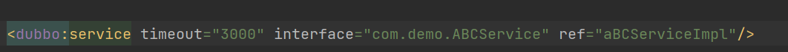
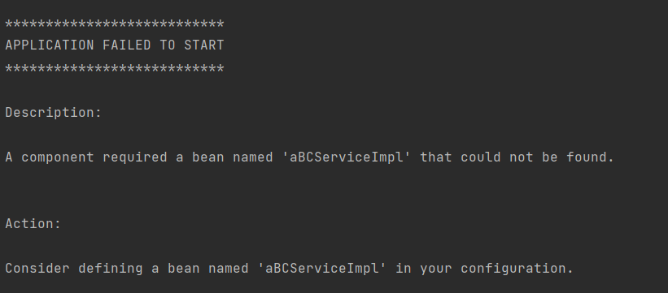
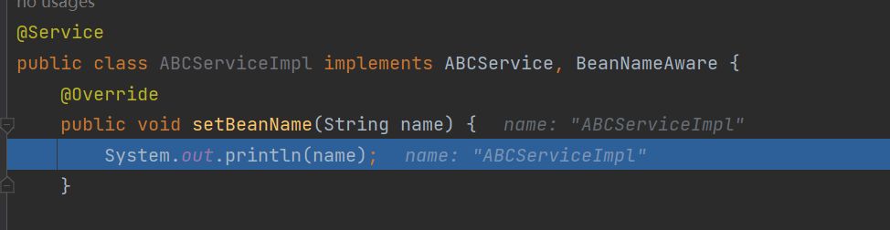
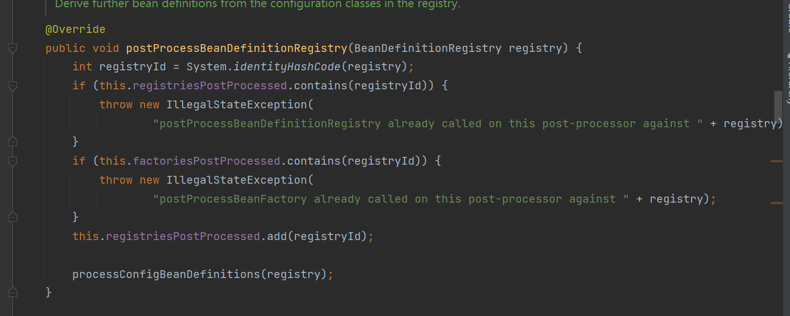
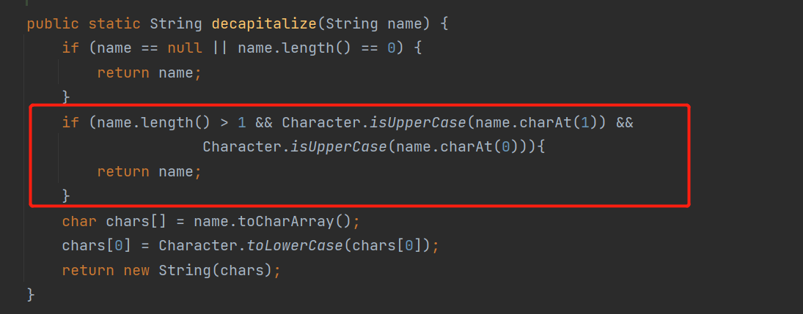

### 问题发现
几天前，在使用 Dubbo 提供接口服务时，定义了一个接口名和类名前几个字符均为大写字母。服务启动时却报错了，错误信息如下：

### 问题解决
在 SpringBean 的生命周期中，有一个 BeanNameAware 的接口，可以在 Bean 实例化时注入 BeanName。这个时候可以把 ABCServiceImpl 实现 BeanNameAware 接口。打点调试，发现 BeanName 为 'ABCServiceImpl'。修改 Dubbo 配置文件。解决该问题。

### 根源排查
在 Spring 中，被 @Service @Component 等注解修饰的类会被 Spring 扫描后生成 BeanDifination（简称BD） 并添加到 beanDefinitionMap 中，而 beanDefinitionMap 最终会用来创建 Bean。
所以如果要知道 beanName 的生成规则，只需要找到 BeanDifination 是如何被扫描并创建的就行。

在 Spring 中，有一个专门用来注册 BD 的接口：BeanDefinitionRegistryPostProcessor（简称BDRPP）；很容易就可以找到具体的实现类：ConfigurationClassPostProcessor，其具体

继续往下看，可以看到是由 ConfigurationClassParser.parse 进行解析的。再一步一步进行定位，最终可以生成 beanName 的方法：Introspector.decapitalize。可以看出如果类名的前两个字符是大写字母，那么就直接把类名作为 beanName 返回。
